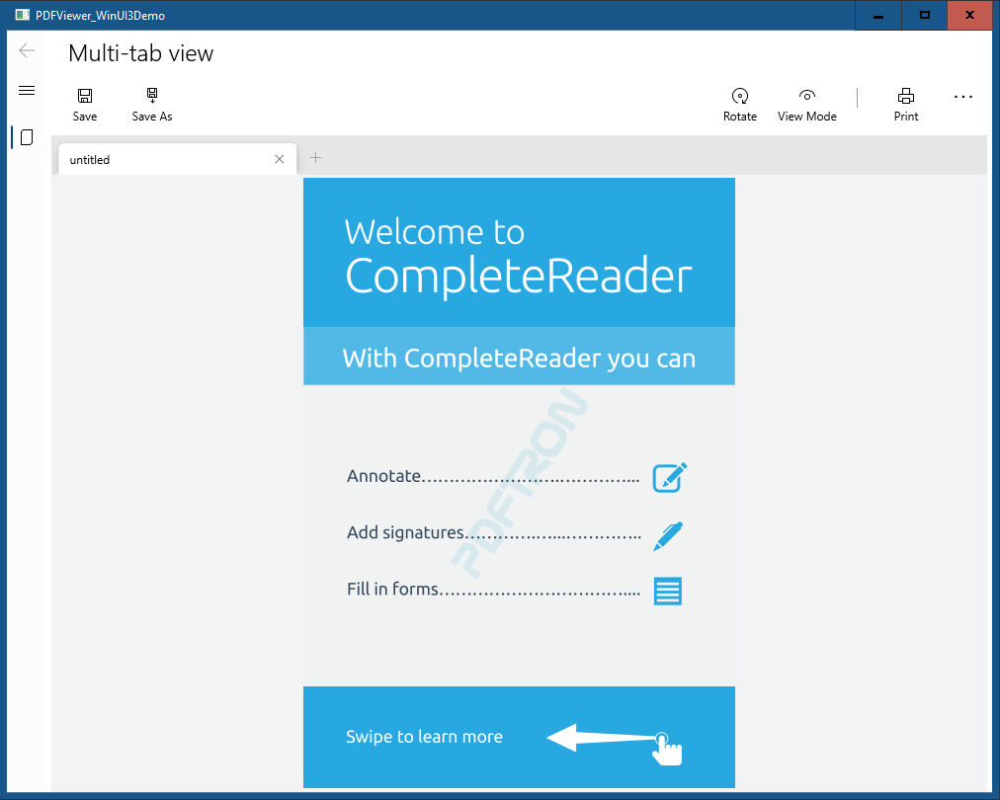

# PDFViewer WinUI3 Sample

This sample demonstrate how to create WinUI 3 desktop application for viewing, annotate, convert, etc.

### Features
- Open multiples PDFs
- Print PDF file
- Annotation with multiples tools

Platforms: x86, x64

## Running the Sample

To run the sample, open the solution in Visual Studio 2019 and restore all the Nuget packages

## License

See [license](./../LICENSE).
